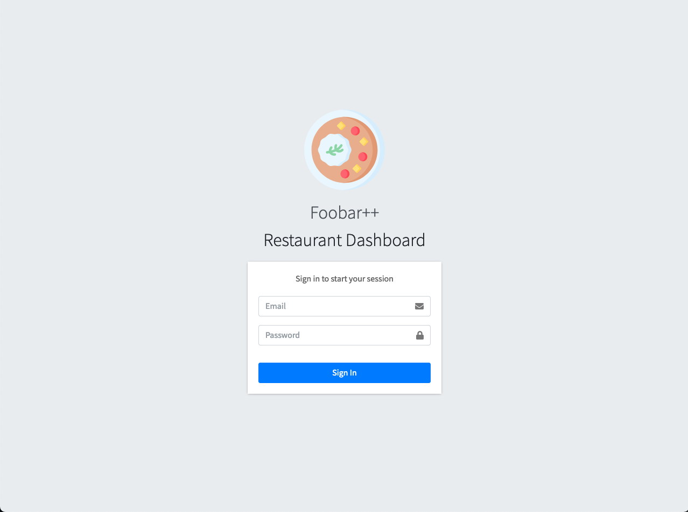
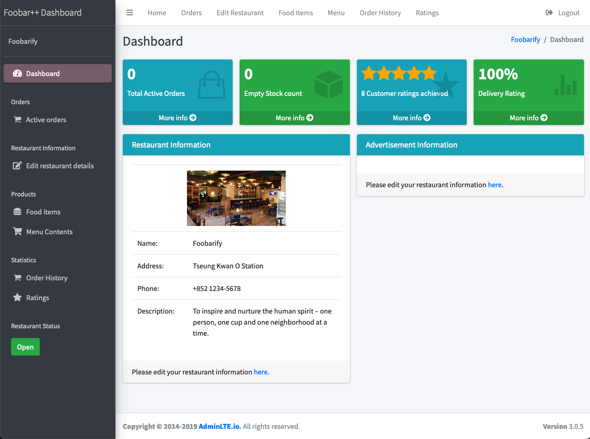
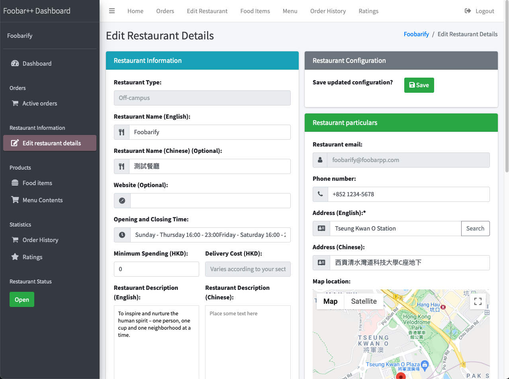
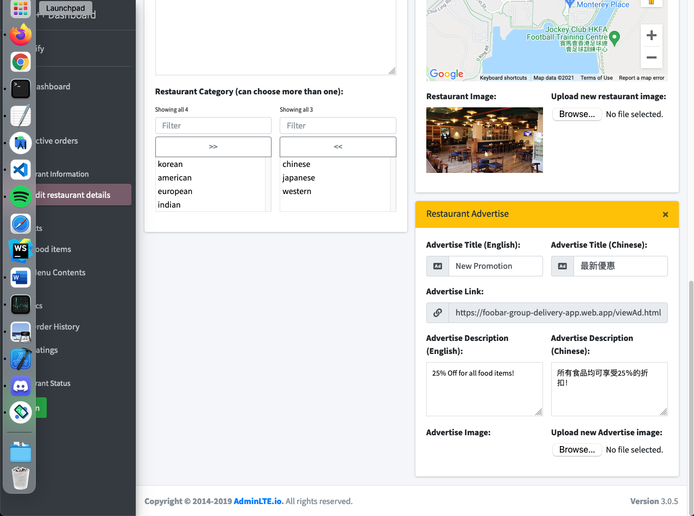
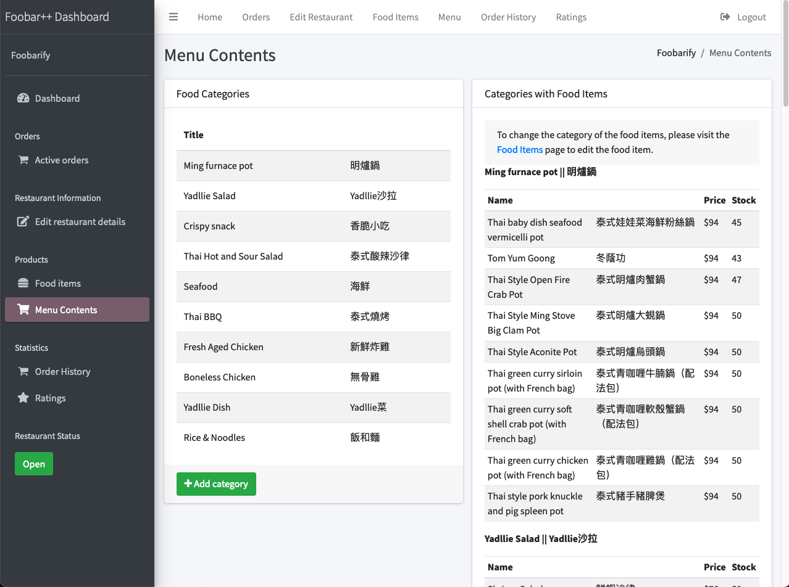
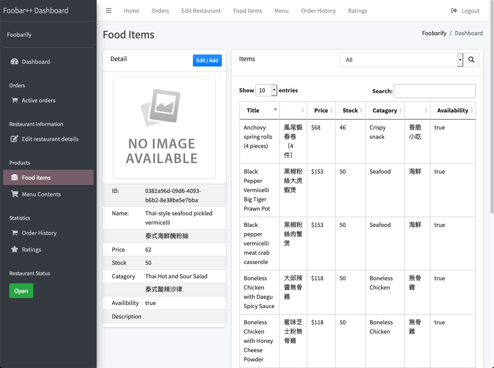
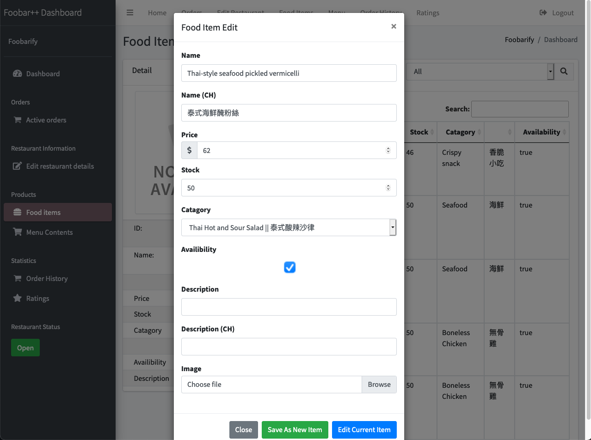
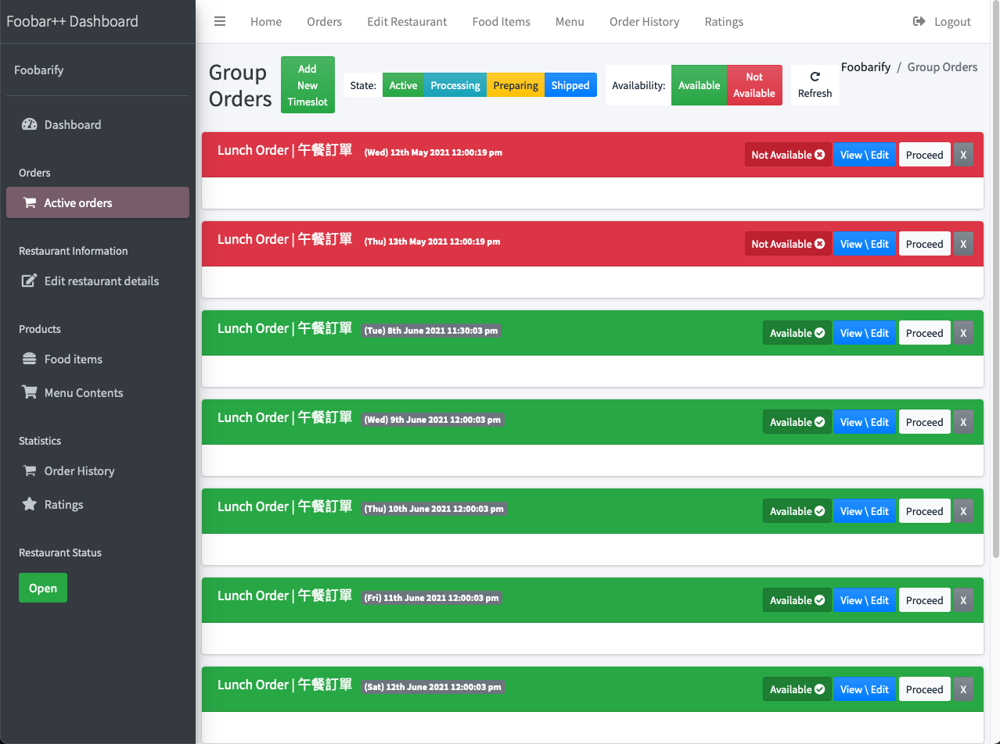
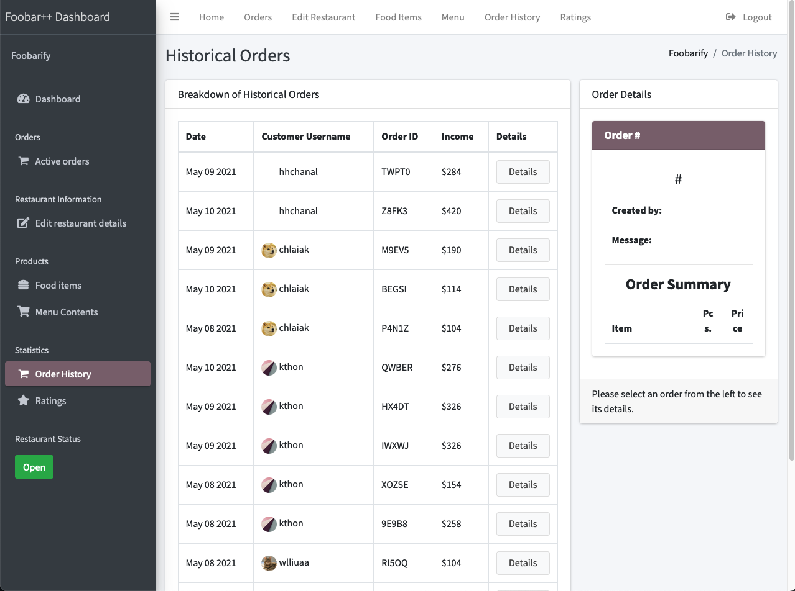
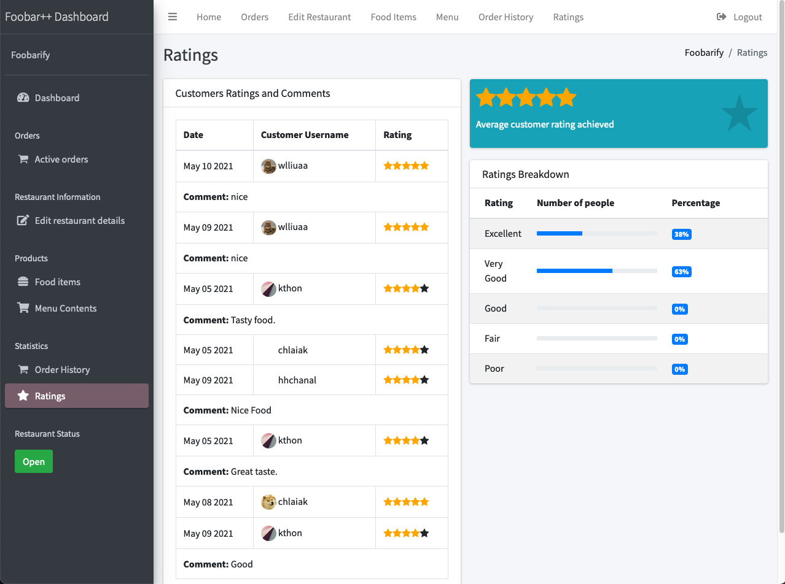

# Foobar++ Web

Foobar++ is a group ordering and delivery application.

## Description

Food ordering and delivery services such as FoodPanda serve individual customers. Many restaurants do not deliver to the UST area. This project will create a mobile app that supports group orders to individual vendors.

## Libraries Used

* **AdminLTE** - Built on top of Bootstrap, AdminLTE provides a range of responsive, reusable, and commonly used components. 

* **jQuery** - jQuery is a fast, small, and feature-rich JavaScript library. 

## Screenshots

    
    
    
    
    
    
    
    
    
    

 

